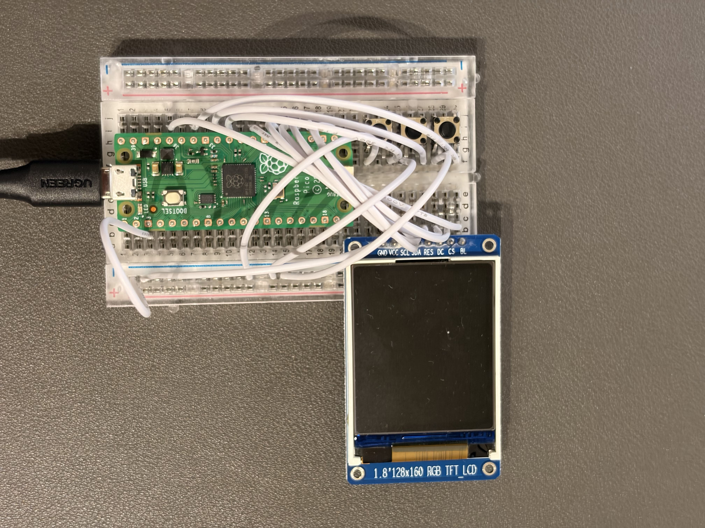

# Breadboard Layout & Wiring

This document provides the physical and electrical specifications for the Agent Monitor hardware.

---

## 1. Bill of Materials

| Item | Quantity | Description |
| :--- | :--- | :--- |
| **Raspberry Pi Pico** | 1 | RP2040 Microcontroller (Pico or Pico 2) |
| **ST7735 1.8" LCD** | 1 | 128x160 TFT Display (SPI Interface) |
| **Tactile Buttons** | 3 | B3F-1020 4-pin switches |
| **Breadboard** | 1 | 400-point |
| **Jumper Wires** | ~15 | Male-to-Male |
| **USB Cable** | 1 | Micro-USB |

---

## 2. Complete Pinout Table

### Pico Positioning
| Direction | Header | Row Range |
| :--- | :--- | :--- |
| Left Header Pin 1~20 | Column C | Row 1 ~ Row 20 |
| Right Header Pin 40~21 | Column H | Row 1 ~ Row 20 |

---

### LCD Screen Wiring (Inserted at Column A, Row 23~30)
| Row | Column A Pin | Connect To |
| :--- | :--- | :--- |
| Row 23 | GND | Lower blue GND rail (-) |
| Row 24 | VCC | Pico **Pin 36 (3V3) / Row 5 Col H** |
| Row 25 | SCL (SCK) | Pico **Pin 24 (GP18) / Row 17 Col H** |
| Row 26 | SDA (MOSI) | Pico **Pin 25 (GP19) / Row 16 Col H** |
| Row 27 | RES (RESET) | Pico **Pin 27 (GP21) / Row 14 Col H** |
| Row 28 | DC (A0) | Pico **Pin 26 (GP20) / Row 15 Col H** |
| Row 29 | CS | Pico **Pin 22 (GP17) / Row 19 Col H** |
| Row 30 | BL (Backlight)| Pico **Pin 29 (GP22) / Row 12 Col H** |

---

### Button Wiring (B3F-1020 Vertically Placed on Right)

Buttons span across rows; one side connects to GND, the other to the GPIO signal pin.

| Button Function | Row (GND Side) | Row (Signal Side) | Pico GPIO | Pico Pin (Physical) |
| :--- | :--- | :--- | :--- | :--- |
| **PREV (UP)** | **Row 22** | **Row 24** | **GP26** | **Pin 31** |
| **NEXT (DOWN)** | **Row 25** | **Row 27** | **GP27** | **Pin 32** |
| **SELECT** | **Row 28** | **Row 30** | **GP28** | **Pin 34** |

#### Jumper Wire Steps:
1. **GND Circuit**:
   - Connect any hole in **Row 22, Row 25, and Row 28** (e.g., Col H or Col J) to the **lower blue GND rail (-)**.
   - **MANDATORY**: Connect Pico **Pin 3 (GND)** to the **lower blue GND rail (-)** to provide a common ground for the entire circuit.
   - Ensure the LCD GND (Row 23) is also connected to this rail.

2. **Signal Circuit**:
   - **Row 24** (Col H/J) → Pico **Pin 31 (GP26)**
   - **Row 27** (Col H/J) → Pico **Pin 32 (GP27)**
   - **Row 30** (Col H/J) → Pico **Pin 34 (GP28)**

---

## 2. Software GPIO Mapping Table

| Function | GPIO | Pico Pin | Code #define |
| :--- | :--- | :--- | :--- |
| LCD CS | GP17 | Pin 22 | `PIN_CS 17` |
| LCD SCK | GP18 | Pin 24 | `PIN_SCK 18` |
| LCD MOSI | GP19 | Pin 25 | `PIN_MOSI 19` |
| LCD DC | GP20 | Pin 26 | `PIN_DC 20` |
| LCD RST | GP21 | Pin 27 | `PIN_RESET 21` |
| LCD BL | GP22 | Pin 29 | `PIN_BL 22` |
| Onboard LED | GP25 | Pin — | `LED_PIN 25` |
| **PREV Button** | **GP26** | **Pin 31** | `BTN_PREV 26` |
| **NEXT Button** | **GP27** | **Pin 32** | `BTN_NEXT 27` |
| **SELECT Button** | **GP28** | **Pin 34** | `BTN_SELECT 28` |

---

## 3. Physical Photo

