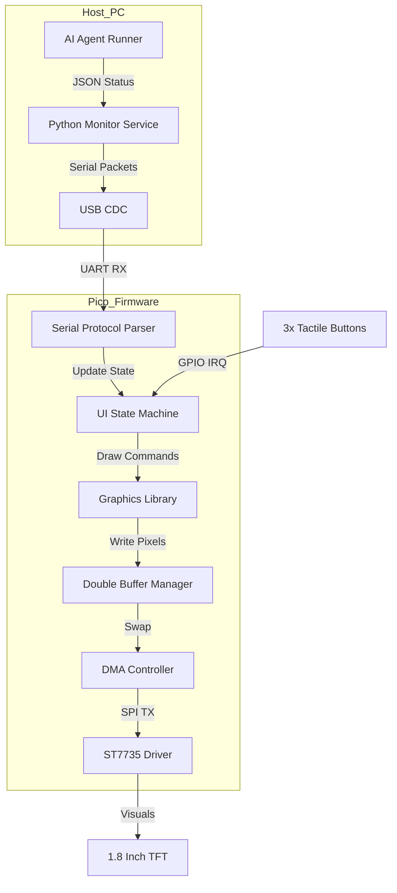

# Design Doc: Agent Monitor Embedded System

**Author:** Gemini CLI / joeyweii  
**Status:** In-Review  
**Last Updated:** 2026-06-12

---

## 1. Abstract / Summary
The **Agent Monitor** is a dedicated hardware peripheral designed to provide real-time status visibility for autonomous AI agents. Built on the Raspberry Pi Pico (RP2040) platform, it features a 1.8" TFT LCD and a 3-button navigation interface. The system provides a "smartwatch-like" glanceable experience, allowing users to monitor agent status, health, tasks, and approval requests at any time—even when away from their workstation (e.g., during lunch)—without requiring active interaction with a PC.

## 2. System Architecture

### 2.1 Overview Diagram

### 2.2 Hardware Design
For detailes, refer to the **[Breadboard Layout & Wiring Guide](breadboard_layout.md)**.

### 2.3 Interrupt-Driven Framework
The system leverages an interrupt-driven architecture to maximize responsiveness and minimize CPU idle-waiting:
*   **DMA Display Transfers**: SPI transfers are managed by a DMA controller. A DMA IRQ handler triggers upon completion, allowing the CPU to perform logic and rendering while the previous frame is being transmitted.
*   **GPIO Button Interrupts**: Button presses are captured via GPIO edge-triggered interrupts. This eliminates the need for polling and ensures high-priority input handling.
*   **Serial Communication (USB CDC)**: Data arrival on the USB port triggers a TinyUSB callback (`tud_cdc_rx_cb`), which pushes bytes into a thread-safe ring buffer.
*   **Main Loop Sleep**: The processor utilizes `__wfi()` (Wait For Interrupt) to enter a low-power state when no events are pending, waking up only to process protocol, button, or display events.

### 2.4 Double Buffering (Ping-Pong)
To achieve flicker-free animations and high-performance rendering, the system employs a **Double Buffering** strategy:
*   **Back Buffer**: The CPU performs all drawing operations (clearing, rectangles, text) into this 40KB SRAM array.
*   **Front Buffer**: Currently being read by the DMA controller and transmitted to the LCD.
*   **Synchronization**: Upon completion of a frame, the pointers are swapped. The system uses a DMA Interrupt to track transfer completion.

### 2.5 Asynchronous DMA SPI
The CPU does not block during screen updates.
*   **Transfer Size**: 128 * 160 * 2 = 40,960 bytes per frame.
*   **SPI Speed**: 24MHz (target).
*   **DMA Configuration**: 16-bit transfers from SRAM to SPI TX FIFO.
*   **IRQ Handling**: A dedicated DMA handler clears interrupt flags and releases Chip Select (CS) upon completion.

### 2.6 Communication Protocol
A robust, length-prefixed binary/text protocol over USB Serial:
- `SET:<id>:<status_len>:<name_len>:<msg_len>:<payload>`
- **Example**: `SET:1:7:7:24:RUNNING:Agent_A:Processing user query...`
- **Benefit**: Immune to delimiter collisions; allows multi-sentence messages; memory-safe.
- **Parsing**: A two-stage state machine consumes header metadata, then exactly N payload bytes from a ring buffer.

### 2.7 UI State Machine
The system operates as a finite state machine (FSM):
*   **LIST_VIEW**: Main carousel of active agents.
*   **DETAIL_VIEW**: Expanded view with agent messages and scrolling text.

### 2.8 Power Management
As a portable-ready peripheral, power efficiency is a core design pillar:
*   **Dynamic Backlight**: PWM-based dimming for idle states (Planned).
*   **Event-based Wake**: Hardware interrupts on button pins and USB serial to wake the processor from `__wfi()`.

## 3. Development Roadmap
For detailes, refer to the **[Roadmap](roadmap.md)**.
The project is divided into logical milestones:

### Milestone 1: Baseline System (Phases 1-6)
Core infrastructure including driver, graphics foundation, communication protocol, and basic UI navigation.

### Milestone 2: Professional UI & Performance (Phases 7-10)
Advanced graphical widgets, interrupt-driven core, partial screen rendering, and power management.

## 4. Project Goals
*   **Performance**: Stable 30+ FPS UI.
*   **Visibility**: Real-time status for up to 4 concurrent agents.
*   **Reliability**: Robust handling of serial noise and common-ground stability.
*   **UX**: Intuitive 3-button navigation.
