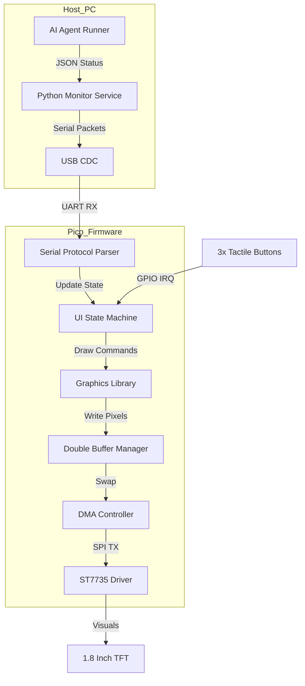

# Design Doc: Agent Monitor Embedded System

**Author:** Gemini CLI / joeyweii  
**Status:** In-Review  
**Last Updated:** 2026-06-12

---

## 1. Abstract / Summary
The **Agent Monitor** is a dedicated hardware peripheral designed to provide real-time status visibility for autonomous AI agents. Built on the Raspberry Pi Pico (RP2040) platform, it features a 1.8" TFT LCD and a 3-button navigation interface. The system provides a "smartwatch-like" glanceable experience, allowing users to monitor agent status, health, tasks, and approval requests at any time—even when away from their workstation (e.g., during lunch)—without requiring active interaction with a PC.

## 2. System Architecture

### 2.1 Overview Diagram

### 2.2 Double Buffering (Ping-Pong)
To achieve flicker-free animations and high-performance rendering, the system employs a **Double Buffering** strategy:
*   **Back Buffer**: The CPU performs all drawing operations (clearing, rectangles, text) into this 40KB SRAM array.
*   **Front Buffer**: Currently being read by the DMA controller and transmitted to the LCD.
*   **Synchronization**: Upon completion of a frame, the pointers are swapped. The system uses a DMA Interrupt to track transfer completion.

### 2.3 Asynchronous DMA SPI
The CPU does not block during screen updates.
*   **Transfer Size**: 128 * 160 * 2 = 40,960 bytes per frame.
*   **SPI Speed**: 24MHz (target).
*   **DMA Configuration**: 16-bit transfers from SRAM to SPI TX FIFO.

### 2.4 Communication Protocol
A lightweight, robust text-based protocol over USB Serial:
*   `SET:<id>:<status_enum>:<name>:<msg>\n` (Host to Pico)
*   `ACTION:<id>:<result_enum>\n` (Pico to Host)
*   `PING/PONG`: Heartbeat for connection monitoring.

## 3. UI State Machine
The system operates as a finite state machine (FSM):
*   **IDLE**: Low-power/Dimmed state.
*   **LIST_VIEW**: Main carousel of active agents.
*   **DETAIL_VIEW**: Expanded view with action buttons (Approve/Reject).
*   **ERROR_VIEW**: System-wide alert for connection loss.

## 4. Hardware Design
For detailes, refer to the **[Breadboard Layout & Wiring Guide](breadboard_layout.md)**.

### 4.1 Key Hardware Components
*   **Microcontroller**: RP2040 (Raspberry Pi Pico).
*   **Display**: 1.8" ST7735 TFT LCD.
*   **Input**: 3x Tactile Buttons (Active-Low).
...
## 5. Goals
*   **Performance**: Stable 30+ FPS UI.
*   **Visibility**: Real-time status for up to 4 concurrent agents.
*   **Reliability**: Robust handling of serial noise and common-ground stability.
*   **UX**: Intuitive 3-button navigation.
